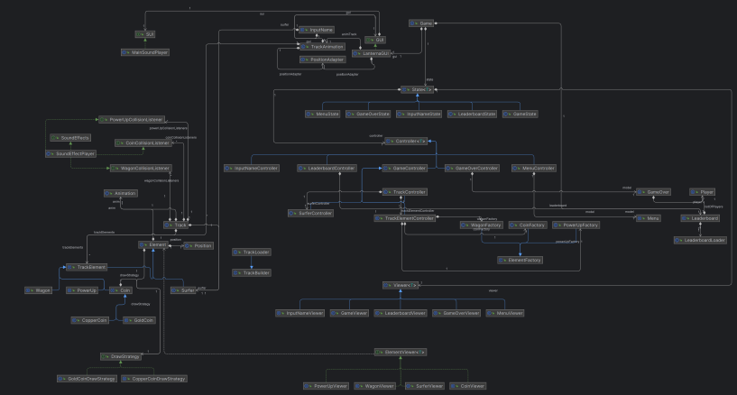
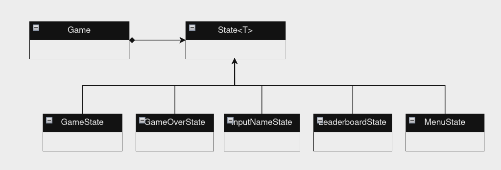
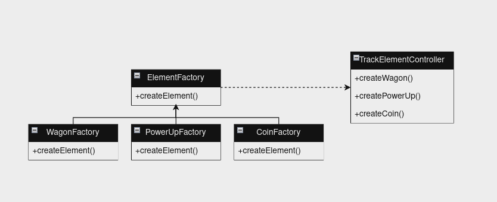
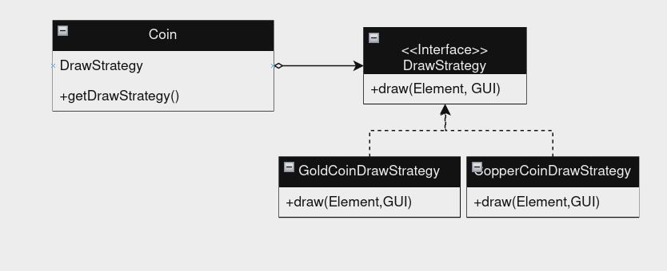
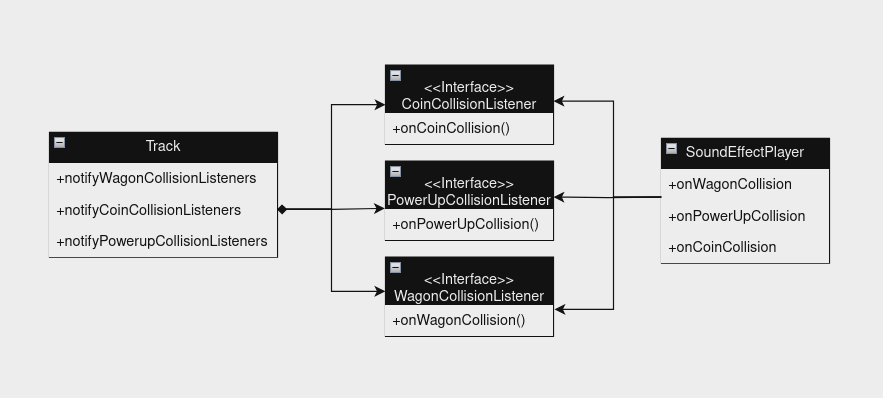
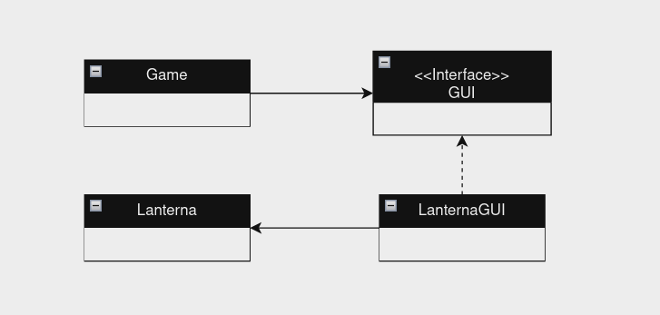
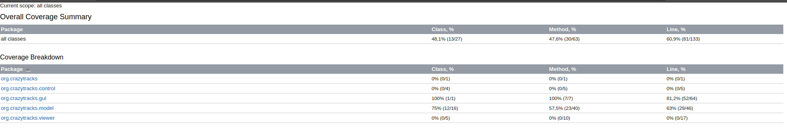

#  **CrazyTracks**

- This game is a java version of Subway Surfers in 2D, you must move your character left and right to avoid being ran over by the trains.
- This project is being developed by _Abecassis Devesse_ (up202209729@fe.up.pt), _Daniel Basílio_ (up201806838@fe.up.pt) and _Rui Borges_ (up202207475@fe.up.pt) for LDTS 2022/2023

### FEATURES

- **Menu** - Responsive menu that allows for the user to choose between starting a game, checking the leaderboard and exiting, it also has a track animation to make it prettier.
- **Game over menu** - When you die a menu with an option to insert your name will be given to you so your playtime can be remembered on Leaderboard.
- **Leaderboard** -  Page that keeps track of the players with the highest scores.
- **Character animation** - The character of the game as an animation to simulate the running.
-  **Character movement** - The character can move left and right, inside of the limits of the track, not being able to move when is at the extremities of the track.
-  **Coins** -  There are two types of coins, copper and gold, that the player can catch that will give him a score bonus.
- **Power ups** - The player can catch a power up that will.  for a certain period of time, increase his score multiplier.
-  **Track randomness** - The game uses a random wagon generator to make sure you will never get the same track (with the same wagon positions).
- **Track movement** - All of the elements in the track will move downwards, inclusive the limits of the track to make the illusion of surfer movement better.
-  **Collision Detection** - The game checks for collisions with coins, power ups and wagons, with the last causing the game to end.
- **Graphics** - The graphics are based on Lanterna with a 1:1 pixel, character scale, making use of fonts to slightly improve the design of the game.
- **Music and sound effects** - The game has background music, and plays specific sounds when it detects certain collisions depending on the type of objects that collide.

### DESIGN

- ### Architecture

      
  

      

This represents the overall design of our game, with its respective MVC architecture      
       

- **Model** - Stores the data from the game and the current state.
- **View** - Interacts with the user showing the elements and gettin input data.
- **Controller** - Defines the rules to be followed, coordinating all the processes that happen in the game.

       

- ### Design Patterns
---   
-**Problem in Context:** The game will change between the menu, the game itself, and the game over sub-menu.      
-**The Pattern:** For this problem, we used the State Pattern because it allows encapsulation of the object state transitions, and still allows for different types of states to be added in the future respecting the Open Closed SOLID principle.      
-**Implementation:** In our game, we have different state classes for each game state (MenuState, GameState, GameOverState). Each state class implements a common interface (GameState) and defines its own version of methods that handle the state-specific behavior. The context object (Game) holds a reference to the current state and delegates state-related tasks to the current state object. This implementation allows the game to change its behavior dynamically based on its current state, without needing to use complex conditional logic.

        
          

  

-**Consequences:**
- _Benefits:_      
  -**Maintainability:** With states isolated, making changes or adding new features specific to a state becomes simpler and less error-prone.    
  -**Flexibility:** The State Pattern allows for easy addition or modification of states without altering existing code, maintaining adherence to the Open Closed SOLID principle.
- _Liabilities:_    
  -**Complexity:** Implementing multiple states might increase initial complexity, especially if the states have intricate interactions or dependencies.    
  -**Overhead:** There might be a slight performance overhead due to managing the list of states and transitioning between them, but this overhead is typically negligible in most scenarios.
---

-**Problem in Context:** Introducing diverse objects within the game's tracks to enhance gameplay variety.      
-**The Pattern:** The Factory Method Pattern is used to manage the creation of diverse track objects effectively. This pattern allows us to encapsulate the creation logic for various track objects (such as obstacles, power-ups, or scenery elements) within separate factory classes. Each factory is responsible for generating a specific type of object, ensuring a cohesive and modular approach to object creation.      
-**Implementation:** In your game, you have different factory classes for each type of track object. Each factory class has a method that creates and returns an instance of the appropriate object. This implementation allows the game to create diverse track objects without needing to know the specific details of how each object is created.

      
        

      

-**Consequences:**
- _Benefits:_      
  -**Flexibility:** The Factory Method Pattern accommodates the addition of new track objects without modifying existing code, aligning with the Open Closed SOLID principle.    
  -**Modularity:** Each factory focuses on producing a particular type of track object, simplifying maintenance and extension by isolating object creation logic.    
  -**Customization:** Different types of objects can be generated with variations or specific behaviors by extending or subclassing the factories.
- _Liabilities:_    
  -**Initial Complexity:** Implementing multiple factories might initially increase complexity, particularly when managing dependencies or interactions between various track objects.    
  -**Overhead:** There might be a slight performance overhead due to the use of multiple factory classes, but this overhead is typically negligible in most scenarios.

      
---
-**Problem in Context:** The game needs to draw different types of coins on the screen, each with its own unique visual representation.      
-**The Pattern:** The Strategy Pattern is used to encapsulate the drawing logic for each type of coin into separate strategy classes. Each strategy represents a distinct drawing method. By dynamically assigning the appropriate strategy to a coin, we can control how coins are drawn without modifying the coin classes extensively.    
-**Implementation:** In our game, we have different strategy classes for each type of drawing method (e.g., GoldCoinDrawStrategy, CopperCoinDrawStrategy). Each strategy class implements a common interface (DrawStrategy) and defines its own version of a method that handles the drawing. The coin objects hold a reference to their draw strategy and delegate the drawing task to the strategy object when needed.

      
        

      

-**Consequences:**
- _Benefits:_      
  -**Flexibility:** The Strategy Pattern allows for easy addition or modification of drawing methods without altering existing code, maintaining adherence to the Open Closed SOLID principle.    
  -**Decoupling:** The strategy doesn't need to know anything about the coins it's drawing, other than that they provide the necessary information for the drawing. This decoupling allows for greater flexibility and modularity in your code.
- _Liabilities:_    
  -**Increased Complexity:** Managing multiple strategies and their interactions might add complexity, especially if strategies are interdependent or have complex logic.    
  -**Overhead:** There might be a slight performance overhead due to managing the list of strategies and choosing the appropriate one, but this overhead is typically negligible in most scenarios.

---
-**Problem in Context:** The game needs to play different sound effects based on various events that occur during gameplay, such as when the player collects a power-up, collides with an obstacle, or achieves a new high score.      
-**The Pattern:** The Observer Pattern is used to allow the SoundEffects class to subscribe to these events and play the appropriate sound effect when these events occur. This pattern allows us to decouple the sound effects from the rest of the game logic, so that the sound effects can be managed independently while still being able to react to relevant events.      
-**Implementation:** In our game, the SoundEffects class is an observer that listens for specific events. When an event such as a power-up being collected occurs, the Observable class (which could be the Game class or any other class that manages game events) calls the update method of the SoundEffects class. The update method receives relevant information about the event, such as the type of power-up collected. Based on this information, the SoundEffects class plays the appropriate sound effect. This implementation allows the SoundEffects class to react to game events independently, without needing to be tightly coupled with the rest of the game logic.

      
        

      

- **Consequences:**
- _Benefits:_      
  -**Flexibility:** The Observer Pattern allows for easy addition or removal of sound effects without modifying the observable's code, adhering to the Open Closed SOLID principle.    
  -**Decoupling:** The observable doesn't need to know anything about the sound effects, other than that they implement the Observer interface. This decoupling allows for greater flexibility and modularity in your code.    
  Event-Driven: The pattern fits well with event-driven systems, which are common in games. This can make the code more intuitive and easier to understand.
- _Liabilities:_    
  -**Initial Complexity:** Implementing the Observer Pattern can add initial complexity to the code, especially if the system has many different types of events and observers.    
  -**Overhead:** There might be a slight performance overhead due to managing the list of observers and dispatching events, but this overhead is typically negligible in most scenarios.    
  -**Debugging Difficulty:** Debugging can be more challenging, as it can be harder to follow the flow of control in an event-driven system compared to a procedural one.
---   
-**Problem in Context:** The game needs to provide a graphical user interface (GUI) for the players. The GUI should be easy to use and should abstract away the complexities of the underlying system.      
-**The Pattern:** The Facade Pattern is used to provide a simplified interface to a complex subsystem. In the context of your game, the LanternaGUI acts as a facade to the complex system of handling user input and rendering graphics on the screen.      
-**Implementation:** In our game, the LanternaGUI class provides a simplified interface for drawing on the screen and handling user input. It hides the complexities of the underlying Lanterna library and provides methods that are easy to use from the rest of your game code. The LanternaGUI class encapsulates the details of initializing the screen, handling keyboard input, and drawing characters and strings at specific positions.

      
        

      

-**Consequences:**
- _Benefits:_      
  -**Simplicity:** The Facade Pattern simplifies the usage of the complex Lanterna library, making it easier to use and reducing the likelihood of errors.    
  -**Decoupling:** The LanternaGUI class decouples the rest of your game code from the specifics of the Lanterna library. This makes it easier to change to a different library in the future if needed.    
  -**Encapsulation:** The LanternaGUI class encapsulates the details of the Lanterna library, preventing the rest of your game code from becoming tightly coupled to these details.
- _Liabilities:_    
  -**Limited Flexibility:** While the LanternaGUI class simplifies the usage of the Lanterna library, it also limits the flexibility. If you need to use features of the Lanterna library that are not exposed by the LanternaGUI class, you would need to modify the LanternaGUI class.    
  -**Overhead:** There might be a slight performance overhead due to the additional layer of abstraction, but this overhead is typically negligible in most scenarios.

---   
### TESTING

      
      

**
