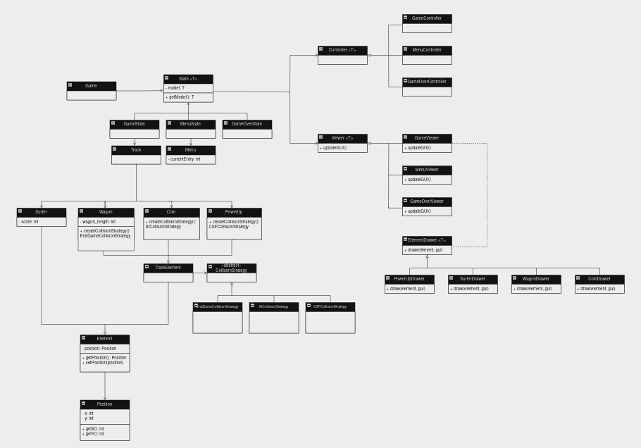
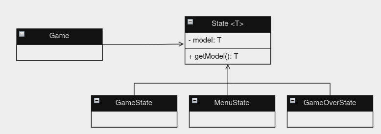
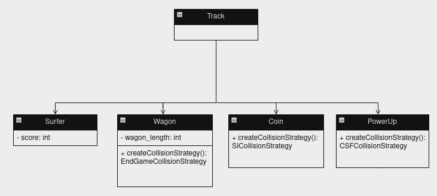

## LDTS_<T><G>CRAZY-ROAD

- This game is a java version of Subway Surfers in 2D, you must move your character left and right to avoid being ran over by the trains.
- This project is being developed by _Abecassis Devesse_ (up202209729@fe.up.pt), _Daniel Basílio_ (up201806838@fe.up.pt) and _Rui Borges_ (up202207475@fe.up.pt) for LDTS 2022/2023

###  FEATURES

- **Menu** - Responsive menu that allows for the user to choose between starting a game, checking the leaderboard and exiting, it also has a track animation to make it prettier.
- **Game over menu** - When you die a menu with an option to insert your name will be given to you so your playtime can be remembered on Leaderboard.
- **Leaderboard** -  Page that keeps track of the players with the highest scores.
- **Character animation** - The character of the game as an animation to simulate the running.
-  **Character movement** - The character can move left and right, inside of the limits of the track, not being able to move when is at the extremities of the track.
-  **Coins** -  There are two types of coins, copper and gold, that the player can catch that will give him a score bonus.
- **Power ups**  - The player can catch a power up that will.  for a certain period of time, increase his score multiplier.
-  **Track randomness** - The game uses a random wagon generator to make sure you will never get the same track (with the same wagon positions).
- **Track movement** - All of the elements in the track will move downwards, inclusive the limits of the track to make the illusion of surfer movement better.
-  **Collision Detection** - The game checks for collisions with coins, power ups and wagons, with the last causing the game to end.
- **Graphics** - The graphics are based on Lanterna with a 1:1 pixel, character scale, making use of fonts to slightly improve the design of the game.

### PLANNED FEATURES

- **Movement** - The Surfer will be able to move left and right to avoid being ran over by the wagons.
- **Power-Ups** -- The Surfer will be able to catch Power-ups like coins that will increase his score or trigger certain events.
-
- **Wagon Collision** - Colliding with a Wagon will cause the Surfer to die.
- **Menu** - When opening the game the player will have a Menu to choose what to do.

### DESIGN

- ### Architecture
---  

  
    

  
This represents the overall design of our game, with its respective MVC architecture  
   

- **Model** - Stores the data from the game and the current state.
- **View** - Interacts with the user showing the elements and gettin input data.
- **Controller** - Defines the rules to be followed, coordinating all the processes that happen in the game.

   

- ### Design Patterns
---  

- **Problem in Context.** The game will change beetwen the menu the game itself and the game over sub-menu.
- **The Pattern.** or this problem we used the factory method pattern because it allows encapsolation of the object creating, and still allows for different types of objects to be added in the future respecting que Open Closed SOLID principle.

- **Implementation.**

  
  

  

-   **Consequences:**
-   _Benefits:_
-   **Maintainability:** With states isolated, making changes or adding new features specific to a state becomes simpler and less error-prone.
    -   **Scalability:** Introducing new states or modifying existing ones adheres to the Open Closed SOLID principle, enabling extensibility without modifying existing code.
    -   **Readability:** The code becomes more structured and comprehensible as each state encapsulates its behavior.  
        -   _Liabilities:_
-   **Complexity:** Implementing multiple states might increase initial complexity, especially if the states have intricate interactions or dependencies.
    -   **Potential Overhead:** The overhead of managing multiple state classes might slightly impact performance, although this is usually negligible unless dealing with an extensive number of states.

---  
-   **Problem in Context:** Introducing diverse objects within the game's tracks to enhance gameplay variety.
-   **The Pattern:** We've utilized the Factory Method Pattern to manage the creation of diverse track objects effectively. This pattern allows us to encapsulate the creation logic for various track objects (such as obstacles, power-ups, or scenery elements) within separate factory classes. Each factory is responsible for generating a specific type of object, ensuring a cohesive and modular approach to object creation.
-   **Implementation:**

  
    

  

-   **Consequences:**
-   _Benefits:_
-   **Flexibility:** The Factory Method Pattern accommodates the addition of new track objects without modifying existing code, aligning with the Open Closed SOLID principle.
    -   **Modularity:** Each factory focuses on producing a particular type of track object, simplifying maintenance and extension by isolating object creation logic.
    -   **Customization:** Different types of objects can be generated with variations or specific behaviors by extending or subclassing the factories.  
        -   _Liabilities:_
-   **Initial Complexity:** Implementing multiple factories might initially increase complexity, particularly when managing dependencies or interactions between various track objects.
    -   **Overhead:** There might be a slight performance overhead due to the use of multiple factory classes, but this overhead is typically negligible in most scenarios.

  
------  
-   **Problem in Context:** Distinguishing reactions based on collisions between the player and different types of objects within the game.
-   **The Pattern:** To address this, we've implemented the Strategy Pattern. This pattern enables us to encapsulate varying collision reactions into separate strategy classes. Each strategy represents a distinct reaction (e.g., player death or score increment) upon collision with different types of objects. By dynamically assigning the appropriate strategy to an object, we can control the player's reactions without modifying the player or object classes extensively.
-   **Implementation:**

  
    

  

-   **Consequences:**
-   _Benefits:_
-   **Flexibility:** The Strategy Pattern allows for easy addition or modification of collision reactions without altering existing code, maintaining adherence to the Open Closed SOLID principle.
    -   **Customization:** Different types of collision reactions can be defined separately, providing granular control over gameplay dynamics.
    -   **Scalability:** As new object types or reactions are introduced, the pattern accommodates these changes seamlessly.  
        -   _Liabilities:_
-   **Increased Complexity:** Managing multiple strategies and their interactions might add complexity, especially if strategies are interdependent or have complex logic.
    -   **Potential Overhead:** There could be a slight overhead due to dynamically assigning strategies during collisions, although in most cases, this impact is negligible.

---  

### TESTING

  
  

